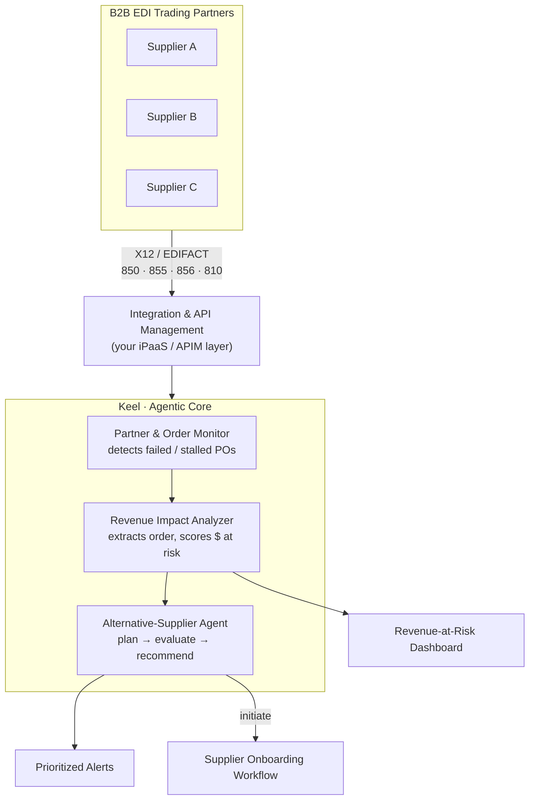

<!--
  FLAGSHIP PROJECT README — "Keel"
  Tailored to your real project: an agentic AI agent for B2B EDI supply chains.
  Working name is "Keel" — rename freely (find & replace "Keel").
  Replace every <PLACEHOLDER> with your real details. Search for "<" to find them all.
  The two things that make THIS stand out as an architect's project:
    1) the architecture diagram below (renders automatically on GitHub)
    2) the "Key design decisions" table — that's where you show senior judgment
-->

<div align="center">

# ⚓ Keel

**Agentic AI for B2B EDI supply chains - it watches your trading partners, flags the revenue at risk when an order fails, and recommends an alternative supplier before the gap becomes a problem.**

[](https://github.com/algoshank-pat/<REPO>/actions/workflows/ci.yml)
[](https://www.python.org/downloads/)
[](LICENSE)

[How it works](#️-how-it-works) · [Quickstart](#-quickstart) · [What it demonstrates](#-what-this-demonstrates)

</div>

---

## The problem

In a B2B supply chain, orders flow between trading partners as **EDI** messages (X12 / EDIFACT — an `850` purchase order, an `855` acknowledgement, an `856` shipping notice, and so on). When one of those orders silently fails - a partner endpoint goes down, an `850` is never acknowledged, a message is rejected - the business often doesn't find out until a shipment is late and revenue has already slipped. The information needed to react (which order, which partner, what it's worth, who else could supply it) is scattered across integration platforms, ERP systems, and partner records.

**Keel closes that gap.** It continuously watches EDI partner and order activity, quantifies the revenue impact of a failure the moment it's detected, and uses an agentic loop to recommend a concrete next action - including which alternative supplier to onboard or route business to.

## What it does

- 🔍 **Tracks B2B EDI trading partners** - monitors the health and message flow of partners across the supply chain, so a stalled or failing partner surfaces immediately instead of days later.
- 💸 **Quantifies revenue at risk** - when a purchase order fails or stalls, Keel extracts the order details and calculates the revenue impact, turning a silent integration error into a ranked, business-prioritized alert.
- 🔌 **Integrates through your API & integration layer** - connects to existing Integration / API Management platforms to pull live order and partner data rather than duplicating it, fitting into the architecture you already run.
- 🤝 **Recommends an alternative supplier** - reasons over partner capability, history, and the at-risk order to suggest the best alternative supplier to onboard or do business with, and can kick off the onboarding workflow.

## 🎬 Demo

<!-- A 10–20s screen recording or even a couple of annotated screenshots here is
     worth more than three paragraphs. Record with Kap (Mac) / ScreenToGif (Win),
     save to assets/demo.gif. If this is a POC, a screenshot of the dashboard is fine. -->

<div align="center">
  
</div>

---

## 🏗️ How it works



**The flow in words:**

1. **Monitor** — Keel reads partner and order activity through the integration/API layer and detects when a purchase order fails, is rejected, or goes unacknowledged.
2. **Quantify** — it extracts the failed order's details and computes the revenue at risk, so failures are ranked by business impact, not just timestamp.
3. **Reason** — the agentic core plans over partner capabilities and order requirements, evaluates candidate suppliers, and reflects on whether a recommendation is well-supported.
4. **Act** — it surfaces a prioritized recommendation and can initiate onboarding for the alternative supplier.

### Key design decisions

<!-- THIS is the section that signals you're an architect, not just a coder.
     Fill these with the real trade-offs you weighed. Examples below — replace. -->

| Decision | Why |
|---|---|
| <e.g. "Read order data via the existing API Management layer instead of a new ERP connector"> | <e.g. "Avoided duplicating a system of record and kept the integration footprint small."> |
| <e.g. "Score revenue-at-risk before recommending"> | <e.g. "Lets the team triage by business impact; a $2M order outranks a $5k one."> |
| <e.g. "Agent abstains when partner data is incomplete"> | <e.g. "A bad supplier recommendation is costlier than asking a human to confirm."> |

---

## ⚡ Quickstart

<!-- Adjust to your real stack. If this is a POC, keep it honest about what runs. -->

```bash
# 1. Clone
git clone https://github.com/algoshank-pat/<REPO>.git
cd <REPO>

# 2. Install
python -m venv .venv && source .venv/bin/activate   # Windows: .venv\Scripts\activate
pip install -r requirements.txt

# 3. Configure
cp .env.example .env
# Add your integration/API-management endpoint + credentials and LLM key to .env

# 4. Run
python -m keel watch                 # start monitoring partner/order activity
python -m keel simulate-failure 850  # demo: simulate a failed PO and see the recommendation
```

See [`docs/`](docs/) for connecting to your integration platform and configuring the revenue model.

---

## 📈 What this demonstrates

<!-- If you have real numbers from a run or POC, put them in the table and delete
     this note. If you DON'T have hard metrics yet, DON'T invent them — keep the
     "capabilities demonstrated" framing below, which is honest and still strong
     for an architect's portfolio. Interviewers respect "POC that proves the
     pattern" far more than suspicious precision. -->

This project demonstrates an end-to-end pattern for **AI-assisted supply-chain resilience**:

- Designing an agentic system that sits *on top of* existing integration/API-management infrastructure rather than replacing it.
- Translating a low-level integration failure (a failed EDI message) into a business signal (revenue at risk).
- Closing the loop from detection → impact → recommendation → action.

**If you've run it, add your real figures:**

| Metric | Result |
|---|---|
| Time-to-detection of a failed PO | <e.g. "minutes vs. hours manually"> |
| Orders monitored across partners | <e.g. "N partners, M orders/day"> |
| Alternative-supplier suggestion accuracy | <e.g. "evaluated on K historical cases"> |

---

## 🗂️ Project structure

```
<REPO>/
├── src/keel/
│   ├── monitor/        # EDI partner & order monitoring
│   ├── risk/           # revenue-impact analysis
│   ├── agent/          # alternative-supplier reasoning loop
│   ├── integration/    # connectors to API / integration management
│   └── api/            # service + dashboard endpoints
├── docs/               # architecture & integration setup
├── tests/
└── assets/             # demo gif, diagrams
```

## 🧰 Built with

`Python 3.11` · `<your agent framework — e.g. LangGraph / Semantic Kernel>` · `<LLM — e.g. Azure OpenAI / OpenAI>` · `<integration platform — e.g. Azure API Management / MuleSoft / Boomi>` · `<EDI tooling, if any>`

## 🗺️ Roadmap

- [ ] <e.g. "Auto-draft the EDI onboarding pack for a recommended supplier">
- [ ] <e.g. "Confidence scoring on revenue-impact estimates">
- [ ] <e.g. "Support for additional EDI document types">

## 🤝 Contributing

See [CONTRIBUTING.md](CONTRIBUTING.md). Open an issue before large changes.

## 📄 License

MIT — see [LICENSE](LICENSE).

---

<div align="center">
<sub>Built by <a href="https://github.com/algoshank-pat">Shashank Patel</a> · <a href="https://www.linkedin.com/in/shashank-patel">LinkedIn</a> · <a href="mailto:<EMAIL>">Email</a></sub>
</div>
